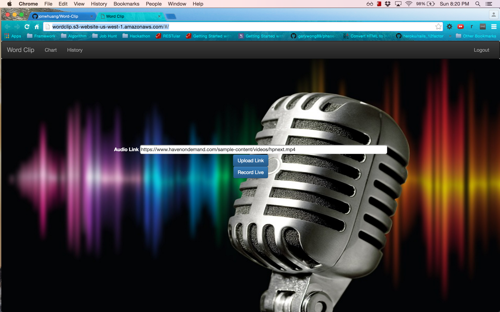
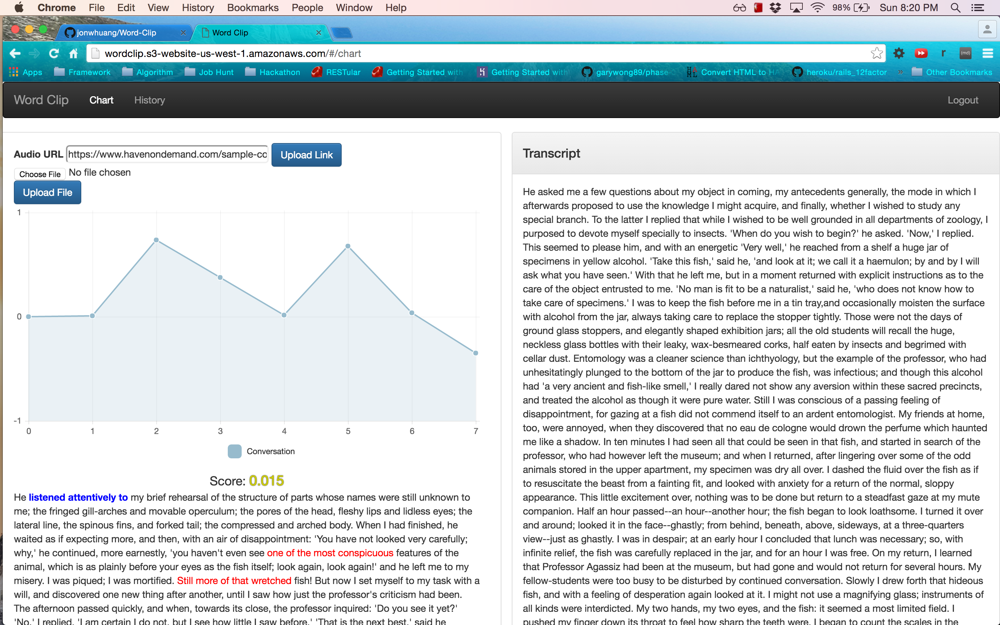

# Word Clip

Utilizing two of HPE Haven OnDemand's APIs, we parse through audio files in segments to provide visualizations of the speaker's sentiment, to indicate trends and even identify specific trigger words.

### The issue we're trying to solve:

You’re in an interview, which questions are giving off a negative vibe? What specific words might be affecting your sentiment on a particular subject?
You’re a therapist: What if you can get a visualization of your client’s emotions, broken down by time segments so you can clearly track your client’s emotional-well being as the conversation progresses from one topic to the next? How keeping track of about with keyword highlights?

There is also a lot of [anecdotal evidence and self-help topics](https://www.google.com/webhp?sourceid=chrome-instant&ion=1&espv=2&ie=UTF-8#q=how%20to%20check%20how%20your%20words%20affect%20others) that say that the choice of words also affects the speaker's perception/outlook in life.

### Status Quo:
- People currently rely on feedback from others
- These feedback can be:
  - subjective
  - inexact

### What we have created:
- Our tool makes analyzing the way we use words:
  - quantifiable
  - easy to track

### Technologies used:
- [HPE Haven On Demand API](https://dev.havenondemand.com/)
- [AngularJS](https://angularjs.org/)
- spin.js
- HTML5
- CSS & Bootstrap

### Contributor List (In Alphabetical Order)
- Bernice Anne W. Chua
  - [GitHub](https://github.com/BerniceChua)
  - [LinkedIn](https://linkedin.com/in/bernicechua415)
  - [Twitter](https://twitter.com/ChuaBernice)
- Michael Du
  - [GitHub](https://github.com/supermikol)
  - [LinkedIn](https://www.linkedin.com/in/michael-du-4927555)
- Jonathan Huang
  - [GitHub](https://github.com/jonwhuang)
  - [LinkedIn](https://www.linkedin.com/in/jonathan-huang-84659971)
- Thomas Huang
- Gary Wong
  - [GitHub](https://github.com/garywong89)
  - [LinkedIn](https://www.linkedin.com/in/garykwong2016)

### Demo
[Live link](http://wordclip.s3-website-us-west-1.amazonaws.com/#/)

License
----
MIT
